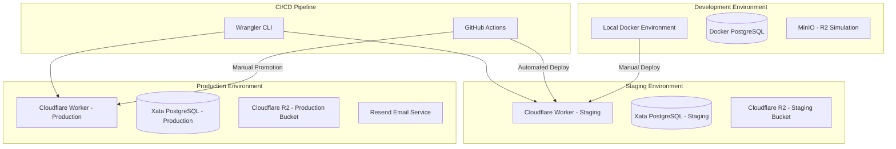

# Deployment Infrastructure Architecture

## Overview

FM5 deployment infrastructure is built on Cloudflare's edge platform, providing global performance, cost-effective scaling, and seamless integration with existing services. This document defines the complete production deployment architecture.

## Architecture Philosophy

- **Edge-First**: Global distribution via Cloudflare Workers for optimal performance
- **Serverless**: No server management overhead, automatic scaling
- **Cost Optimized**: Leverage generous free tiers and pay-per-use pricing
- **Developer Experience**: Simple deployment with Wrangler CLI tooling
- **Environment Isolation**: Clear separation between staging and production

## Cloud Architecture

### Platform Overview



### Core Infrastructure Components

#### Cloudflare Workers
- **Purpose**: Serverless application hosting with global edge distribution
- **Scaling**: Automatic scaling based on demand
- **Performance**: Sub-10ms cold start times, global edge network
- **Cost**: Free tier: 100k requests/day, paid: $5/10M requests

#### Xata PostgreSQL
- **Purpose**: Primary database for all application data
- **Free Tier**: 15GB storage, 250k monthly requests per database
- **Features**: Built-in REST API, full-text search, edge caching
- **Environments**: Separate databases for staging and production
- **Connection**: Direct HTTP API calls (no connection pooling needed)

#### Cloudflare R2
- **Purpose**: File storage for 3D models, sliced files, and generated content
- **Free Tier**: 10GB storage, 1M Class A operations/month
- **Integration**: Native Cloudflare Workers integration
- **Buckets**: Separate staging and production buckets for isolation

#### Resend Email Service
- **Purpose**: Transactional email delivery (user verification, notifications)
- **Free Tier**: 3k emails/month, 100 emails/day
- **Integration**: HTTP API compatible with Cloudflare Workers
- **Features**: Email templates, bounce/complaint handling, analytics

## Infrastructure as Code (IaC)

### Tooling Strategy: Wrangler CLI

**Rationale**: Wrangler provides complete lifecycle management for Cloudflare Workers, including:
- Environment variable management
- Secret management
- R2 bucket configuration
- Custom domain setup
- Deployment automation

### Configuration Files

#### `wrangler.toml` (Staging)
```toml
name = "fm5-staging"
main = ".output/server/index.mjs"
compatibility_date = "2024-09-01"
compatibility_flags = ["nodejs_compat"]

[env.staging]
vars = { NODE_ENV = "staging", APP_ENV = "staging" }

[[env.staging.r2_buckets]]
binding = "FILE_STORAGE"
bucket_name = "fm5-staging-files"

[env.staging.d1_databases]
# Optional: D1 for caching/sessions if needed
```

#### `wrangler.toml` (Production)
```toml
name = "fm5-production"
main = ".output/server/index.mjs"
compatibility_date = "2024-09-01"
compatibility_flags = ["nodejs_compat"]

[env.production]
vars = { NODE_ENV = "production", APP_ENV = "production" }

[[env.production.r2_buckets]]
binding = "FILE_STORAGE"
bucket_name = "fm5-production-files"
```

### Environment Variable Management

**Staging Environment Variables:**
```bash
# Database
XATA_API_KEY=<staging-xata-api-key>
XATA_DATABASE_URL=<staging-xata-database-url>

# Authentication
JWT_SECRET=<staging-jwt-secret>
BETTER_AUTH_SECRET=<staging-auth-secret>

# Email
RESEND_API_KEY=<staging-resend-api-key>

# File Storage
R2_ACCOUNT_ID=<cloudflare-account-id>
R2_ACCESS_KEY_ID=<staging-r2-access-key>
R2_SECRET_ACCESS_KEY=<staging-r2-secret-key>
```

**Production Environment Variables:**
```bash
# Database
XATA_API_KEY=<production-xata-api-key>
XATA_DATABASE_URL=<production-xata-database-url>

# Authentication
JWT_SECRET=<production-jwt-secret>
BETTER_AUTH_SECRET=<production-auth-secret>

# Email
RESEND_API_KEY=<production-resend-api-key>

# File Storage
R2_ACCOUNT_ID=<cloudflare-account-id>
R2_ACCESS_KEY_ID=<production-r2-access-key>
R2_SECRET_ACCESS_KEY=<production-r2-secret-key>
```

## CI/CD Pipeline Architecture

### GitHub Actions Workflow

#### Pipeline Stages
1. **Code Quality**: ESLint, Prettier, TypeScript checking
2. **Testing**: Unit tests, integration tests
3. **Build**: Tanstack Start production build with Nitro
4. **Security**: Dependency vulnerability scanning
5. **Deploy**: Wrangler deployment to staging
6. **Manual Promotion**: Manual trigger for production deployment

#### Workflow Configuration

```yaml
# .github/workflows/deploy.yml
name: Deploy to Cloudflare Workers

on:
  push:
    branches: [main]
  pull_request:
    branches: [main]

jobs:
  test-and-build:
    runs-on: ubuntu-latest
    steps:
      - uses: actions/checkout@v4
      - uses: actions/setup-node@v4
        with:
          node-version: '20'
          cache: 'npm'

      - name: Install dependencies
        run: npm ci

      - name: Run tests
        run: npm test

      - name: Build application
        run: npm run build

      - name: Upload build artifacts
        uses: actions/upload-artifact@v4
        with:
          name: build-output
          path: .output/

  deploy-staging:
    needs: test-and-build
    runs-on: ubuntu-latest
    if: github.ref == 'refs/heads/main'
    steps:
      - uses: actions/checkout@v4
      - uses: actions/download-artifact@v4
        with:
          name: build-output
          path: .output/

      - name: Deploy to staging
        uses: cloudflare/wrangler-action@v3
        with:
          apiToken: ${{ secrets.CLOUDFLARE_API_TOKEN }}
          environment: staging

  deploy-production:
    needs: test-and-build
    runs-on: ubuntu-latest
    if: github.event_name == 'workflow_dispatch'
    environment: production
    steps:
      - uses: actions/checkout@v4
      - uses: actions/download-artifact@v4
        with:
          name: build-output
          path: .output/

      - name: Deploy to production
        uses: cloudflare/wrangler-action@v3
        with:
          apiToken: ${{ secrets.CLOUDFLARE_API_TOKEN }}
          environment: production
```

### Environment Promotion Strategy

1. **Development → Staging**: Automatic on main branch commits
2. **Staging → Production**: Manual trigger via GitHub Actions UI
3. **Rollback**: Wrangler rollback command or redeploy previous version
4. **Testing**: Integration tests run against staging before production promotion

## Database Production Strategy

### Xata Configuration

#### Database Structure
- **Staging Database**: `fm5-staging` - Full feature testing environment
- **Production Database**: `fm5-production` - Live user data
- **Schema Migrations**: Managed through Prisma + Xata schema sync

#### Migration Strategy
1. **Development**: Prisma migrate dev against local PostgreSQL
2. **Staging**: Apply migrations to staging Xata database
3. **Testing**: Validate migrations in staging environment
4. **Production**: Apply tested migrations to production database

#### Backup and Recovery
- **Xata Automatic Backups**: Point-in-time recovery up to 7 days
- **Migration Rollback**: Prisma migration rollback procedures
- **Data Export**: Regular exports for compliance and backup

## Container Integration

### Development Environment
- **Docker Compose**: Existing development setup remains unchanged
- **Local Testing**: Full stack runs locally with Docker services
- **Environment Parity**: Local environment variables match staging/production

### Production Deployment
- **No Containers**: Cloudflare Workers run directly on V8 isolates
- **Build Output**: Tanstack Start Nitro output optimized for Workers runtime
- **Asset Handling**: Static assets served via Cloudflare CDN

## Integration Architecture

### BetterAuth Production Configuration
```typescript
// lib/auth.ts - Production configuration
export const auth = betterAuth({
  database: {
    provider: "postgres",
    url: process.env.XATA_DATABASE_URL,
  },
  session: {
    expiresIn: 60 * 60 * 24 * 7, // 7 days
    updateAge: 60 * 60 * 24, // 24 hours
  },
  jwt: {
    issuer: "fm5-app",
    audience: ["fm5-web"],
  },
  plugins: [
    nodejs(),
    // Add other plugins as needed
  ],
})
```

### Cloudflare R2 Integration
```typescript
// lib/file-storage.ts
interface Env {
  FILE_STORAGE: R2Bucket
}

export async function uploadFile(
  env: Env,
  key: string,
  file: File
): Promise<void> {
  await env.FILE_STORAGE.put(key, file.stream(), {
    httpMetadata: {
      contentType: file.type,
    },
  })
}
```

### Resend Email Integration
```typescript
// lib/email.ts
import { Resend } from 'resend'

const resend = new Resend(process.env.RESEND_API_KEY)

export async function sendVerificationEmail(
  email: string,
  token: string
): Promise<void> {
  await resend.emails.send({
    from: 'noreply@fm5.app',
    to: email,
    subject: 'Verify your FM5 account',
    html: `<p>Click <a href="https://app.fm5.com/verify?token=${token}">here</a> to verify your account.</p>`,
  })
}
```

## Monitoring and Operational Requirements

### Observability Stack
- **Cloudflare Analytics**: Request metrics, performance monitoring
- **Wrangler Tail**: Real-time log streaming for debugging
- **Xata Metrics**: Database performance and usage monitoring
- **Resend Analytics**: Email delivery and engagement metrics

### Alerting Strategy
- **Error Rate Alerts**: >5% error rate triggers notification
- **Performance Alerts**: >1000ms P95 response time alerts
- **Database Alerts**: Connection failures or slow queries
- **Email Delivery**: Bounce rate or delivery failure alerts

### Health Check Endpoints
```typescript
// /health endpoint
export async function healthCheck(): Promise<Response> {
  try {
    // Check database connectivity
    const dbCheck = await xata.db.users.getFirst()

    // Check R2 connectivity
    const r2Check = await env.FILE_STORAGE.head('health-check')

    return new Response(JSON.stringify({
      status: 'healthy',
      timestamp: new Date().toISOString(),
      services: {
        database: 'ok',
        storage: 'ok'
      }
    }), {
      headers: { 'Content-Type': 'application/json' }
    })
  } catch (error) {
    return new Response(JSON.stringify({
      status: 'unhealthy',
      error: error.message
    }), {
      status: 500,
      headers: { 'Content-Type': 'application/json' }
    })
  }
}
```

## Security Configuration

### Environment Security
- **Secrets Management**: Cloudflare Workers secrets (encrypted at rest)
- **API Key Rotation**: Regular rotation of database and service API keys
- **CORS Configuration**: Strict origin policies for production
- **Rate Limiting**: Per-user quotas via Cloudflare Workers

### Authentication Security
- **JWT Configuration**: Short-lived access tokens, secure refresh flow
- **Session Security**: HttpOnly cookies, secure flag, SameSite strict
- **Password Policy**: BetterAuth default security policies
- **MFA Support**: Ready for future multi-factor authentication

### File Security
- **Upload Validation**: File type and size restrictions
- **Access Control**: Signed URLs for secure file access
- **User Isolation**: File paths include user ID for isolation
- **Malware Scanning**: Future integration with Cloudflare scanning

## Cost Management

### Cost Optimization Strategy
- **Cloudflare Workers**: $5/10M requests (very cost effective)
- **Xata Free Tier**: 15GB storage, 250k requests/month per database
- **R2 Storage**: $0.015/GB/month, free tier: 10GB
- **Resend**: $20/month for 100k emails (after free tier)

### Monitoring and Alerts
- **Usage Tracking**: Monthly cost reports via Cloudflare dashboard
- **Threshold Alerts**: Notify before exceeding free tier limits
- **Optimization**: Regular review of usage patterns and costs

### Scaling Considerations
- **Database**: Xata scales automatically, pricing based on usage
- **Workers**: Automatic scaling, pay per request model
- **Storage**: R2 scales automatically, pay per GB stored
- **Email**: Resend scales based on volume, predictable pricing

## Compliance and Backup

### Data Protection
- **GDPR Compliance**: User data export and deletion procedures
- **Data Residency**: Cloudflare global network, Xata EU/US regions
- **Encryption**: All data encrypted in transit and at rest
- **Audit Logging**: Request logging for security and compliance

### Backup Strategy
- **Database**: Xata automatic backups, point-in-time recovery
- **File Storage**: R2 versioning and lifecycle policies
- **Configuration**: Infrastructure configuration stored in Git
- **Recovery Testing**: Regular backup recovery validation

This deployment infrastructure provides a scalable, cost-effective foundation for FM5's production environment while maintaining excellent developer experience and operational simplicity.