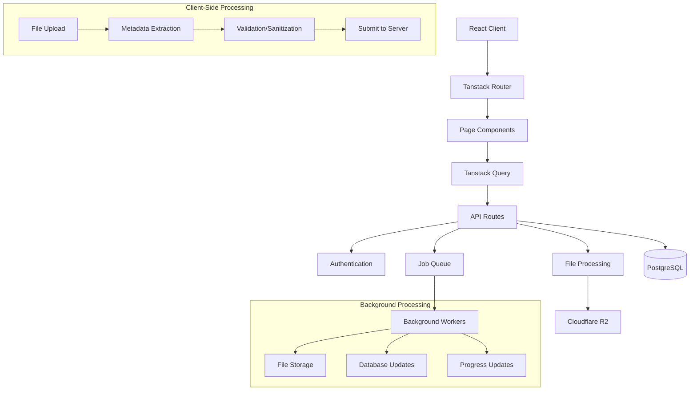
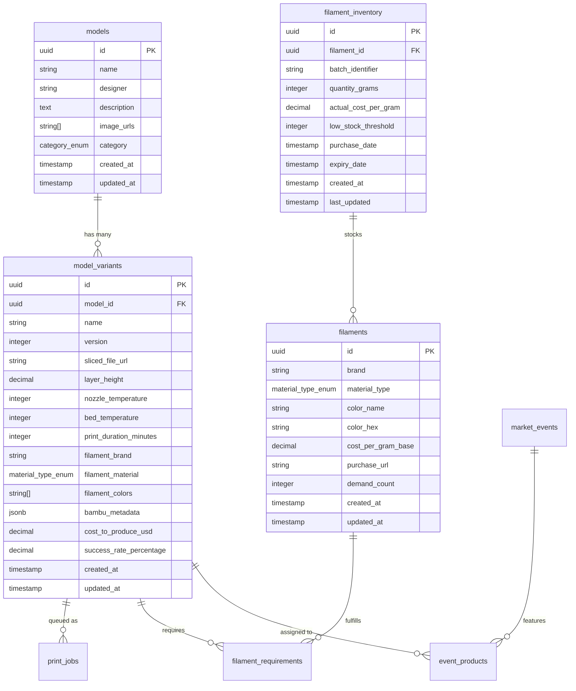

# tRPC API Specification with Zod

## Router Definition with Zod Validation

```typescript
import { initTRPC } from '@trpc/server';
import { UserSchema, ModelSchema, ModelVariantSchema, FilamentSchema, FilamentInventorySchema } from '@/lib/schemas';
import { authenticateUser } from '@/lib/auth';

const t = initTRPC.context<{ user?: User }>().create();

// Authentication middleware
const requireAuth = t.middleware(async ({ next, ctx }) => {
  if (!ctx.user) {
    throw new Error('Authentication required');
  }
  return next({ ctx: { ...ctx, user: ctx.user } });
});

const protectedProcedure = t.procedure.use(requireAuth);

export const appRouter = t.router({
  // Authentication API
  auth: t.router({
    me: protectedProcedure
      .query(async ({ ctx }) => {
        return UserSchema.parse(ctx.user);
      }),

    updateProfile: protectedProcedure
      .input(UserSchema.omit('id', 'createdAt', 'updatedAt').partial())
      .mutation(async ({ input, ctx }) => {
        // Update user profile with validation
      }),
  }),

  // Models API (Protected)
  models: t.router({
    list: protectedProcedure
      .input(type({
        'search?': 'string',
        'category?': "'keychain'|'earring'|'decoration'|'functional'",
        'limit?': 'number>=1<=100',
        'offset?': 'number>=0'
      }))
      .output(type({
        models: ModelSchema.array(),
        total: 'number',
        hasMore: 'boolean'
      }))
      .query(async ({ input }) => {
        // Implementation with full-text search and pagination
      }),

    create: protectedProcedure
      .input(ModelSchema.omit('id', 'userId', 'createdAt', 'updatedAt'))
      .output(ModelSchema)
      .mutation(async ({ input, ctx }) => {
        // Create new model with user isolation
        const model = { ...input, userId: ctx.user.id };
        // Implementation with user validation
      }),

    byId: protectedProcedure
      .input(type({ id: 'string' }))
      .output(ModelSchema.merge(type({ variants: ModelVariantSchema.array() })))
      .query(async ({ input, ctx }) => {
        // Get model with all variants (user-isolated via RLS)
      }),
  }),

  // Model Variants API (Protected)
  variants: t.router({
    create: protectedProcedure
      .input(type({
        modelId: 'string',
        variantData: ModelVariantSchema.omit('id', 'createdAt', 'updatedAt'),
        filamentRequirements: type({
          filamentId: 'string',
          amsSlot: 'number',
          usageModel: 'number',
          usageWaste: 'number',
          usagePurge: 'number'
        }).array()
      }))
      .output(ModelVariantSchema)
      .mutation(async ({ input }) => {
        // Create new variant with filament requirements
      }),

    update: t.procedure
      .input(type({
        id: 'string',
        updates: ModelVariantSchema.partial().omit('id', 'createdAt', 'updatedAt')
      }))
      .output(ModelVariantSchema)
      .mutation(async ({ input }) => {
        // Update variant (creates new version if needed)
      }),

    checkFeasibility: protectedProcedure
      .input(type({ variantId: 'string' }))
      .output(type({
        feasible: 'boolean',
        'missingFilaments?': type({
          filament: FilamentSchema,
          requiredGrams: 'number',
          availableGrams: 'number'
        }).array(),
        'warnings?': 'string[]'
      }))
      .query(async ({ input }) => {
        // Check if variant can be printed with current inventory
      }),
  }),

  // File Processing API
  files: t.router({
    upload: t.procedure
      .input(type({
        fileName: 'string',
        fileSize: 'number',
        contentType: 'string'
      }))
      .output(type({
        uploadUrl: 'string',
        fileId: 'string',
        jobId: 'string'
      }))
      .mutation(async ({ input }) => {
        // Generate signed upload URL for Cloudflare R2
      }),

    processStatus: t.procedure
      .input(type({ jobId: 'string' }))
      .output(type({
        jobId: 'string',
        status: "'pending'|'processing'|'completed'|'failed'",
        progress: 'number>=0<=100',
        'message?': 'string',
        'error?': 'string',
        'result?': type({
          'modelId?': 'string',
          'variantId?': 'string',
          'extractedData?': 'unknown' // BambuMetadata structure
        })
      }))
      .query# 3D Printing Business Management Platform - Full-Stack Architecture Document

# Introduction

This document outlines the complete full-stack architecture for the 3D Printing Business Management Platform, including backend systems, frontend implementation, and their integration. It serves as the single source of truth for AI-driven development, ensuring consistency across the entire technology stack.

This unified approach combines backend and frontend architecture concerns, streamlining the development process for modern full-stack applications where these concerns are increasingly intertwined.

## Document Scope

This architecture focuses on creating a scalable, efficient system for small 3D printing businesses to manage digital assets, inventory, and production workflows. The system prioritizes operational efficiency, data accuracy, and user experience while maintaining development simplicity.

## Change Log

| Date | Version | Description | Author |
|------|---------|-------------|--------|
| 2025-09-18 | 1.0 | Initial full-stack architecture | Architect Winston |

# Tech Stack Decisions

## Core Technology Stack

| Category | Technology | Version | Rationale |
|----------|------------|---------|-----------|
| **Framework** | Tanstack Start | Latest | Full-stack React framework with excellent DX |
| **Runtime** | Node.js | 20+ | Required for Tanstack Start |
| **Language** | TypeScript | 5.0+ | Type safety across entire stack |
| **Database** | PostgreSQL | 18 Beta | Robust relational database with latest JSONB enhancements |
| **ORM** | PrismaORM | 5.0+ | Type-safe database access with great DX |
| **Database Tools** | Tanstack DB | Latest | Type-safe database queries integrated with ecosystem |
| **State Management** | Tanstack Query | v5 | Server state management and caching |
| **Form Handling** | Tanstack Form | Latest | Type-safe form validation and handling |
| **UI Components** | React Aria | Latest | Accessibility-first component primitives |
| **Styling** | TailwindCSS | 3.4+ | Utility-first CSS framework |
| **Type Safety** | Zod + tRPC | Latest | End-to-end type safety with runtime validation |
| **Client Database** | Tanstack DB | Latest | Reactive client-side database with live queries |
| **File Storage** | Cloudflare R2 | - | S3-compatible object storage |
| **Dev Database** | Docker PostgreSQL | 18 Beta | Local development environment |
| **Prod Database** | Xata | - | Managed PostgreSQL with additional features |

## Technology Rationale

**Tanstack Ecosystem Choice:**
- **Unified TypeScript Experience**: End-to-end type safety from database to UI
- **Excellent Developer Experience**: Hot reload, type checking, integrated tools
- **Performance Optimized**: Built-in caching, optimistic updates, background sync
- **Future-Proof**: Modern React patterns with server components support

**Tanstack DB Integration:**
- **Reactive Collections**: Client-side database with differential dataflow
- **Live Queries**: Automatic updates when underlying data changes  
- **Optimistic Mutations**: Immediate UI updates with automatic rollback
- **Sub-millisecond Performance**: Complex queries with joins across collections
- **Eliminates Query Boilerplate**: Collections replace most useQuery patterns

**Zod + tRPC Strategy:**
- **Runtime Validation**: Zod schemas validate at compile time and runtime
- **Type-Safe APIs**: tRPC procedures use Zod for input/output validation
- **1:1 Type Mapping**: Runtime types exactly match TypeScript interfaces
- **Better Performance**: Optimized validation compared to alternatives

# Architectural Patterns

## System Architecture



## Core Architectural Principles

1. **File Processing on Client**: Extract metadata client-side for immediate form auto-fill
2. **Async Background Jobs**: Handle file uploads and processing asynchronously
3. **Optimistic Updates**: Use Tanstack Query for immediate UI feedback
4. **Progressive Enhancement**: Core functionality works without JavaScript
5. **Type Safety**: End-to-end TypeScript from database to UI components

# Data Models

## Core Entity Relationships



## Zod Schema Definitions

```typescript
import { z } from 'zod';

// User Authentication Schema
export const UserSchema = type({
  id: 'string',
  email: 'string', // format validated separately
  name: 'string',
  'businessName?': 'string',
  'businessDescription?': 'string',
  preferences: type({
    'units?': "'metric'|'imperial'",
    'defaultFilamentBrand?': 'string',
    'notifications?': type({
      email: 'boolean',
      lowStock: 'boolean',
      printComplete: 'boolean',
      systemUpdates: 'boolean'
    })
  }),
  createdAt: 'Date',
  updatedAt: 'Date',
  'lastLoginAt?': 'Date'
});

// Core Model Types using Zod (now with user isolation)
export const ModelSchema = type({
  id: 'string',
  userId: 'string', // User isolation
  name: 'string',
  designer: 'string',
  'description?': 'string',
  imageUrls: 'string[]',
  category: "'keychain'|'earring'|'decoration'|'functional'",
  createdAt: 'Date',
  updatedAt: 'Date'
});

export const ModelVariantSchema = type({
  id: 'string',
  userId: 'string', // User isolation
  modelId: 'string',
  name: 'string',
  version: 'number',
  slicedFileUrl: 'string',
  
  // Fast-access structured fields
  layerHeight: 'number',
  nozzleTemperature: 'number',
  bedTemperature: 'number',
  printDurationMinutes: 'number',
  
  // Complete Bambu Studio metadata (JSONB)
  bambuMetadata: 'unknown', // JSONB field - validated separately
  
  // Business metrics
  costToProduceUsd: 'number',
  successRatePercentage: 'number',
  
  createdAt: 'Date',
  updatedAt: 'Date'
});

// Filament specification (separate from inventory, user-isolated)
export const FilamentSchema = type({
  id: 'string',
  userId: 'string', // User isolation
  brand: 'string',
  materialType: "'PLA'|'PETG'|'ABS'|'TPU'",
  colorName: 'string',
  colorHex: 'string', // format validated separately
  costPerGramBase: 'number',
  'purchaseUrl?': 'string',
  demandCount: 'number', // how many variants use this filament
  createdAt: 'Date',
  updatedAt: 'Date'
});

// Physical filament inventory (spools in stock, user-isolated)
export const FilamentInventorySchema = type({
  id: 'string',
  userId: 'string', // User isolation
  filamentId: 'string', // reference to Filament
  'batchIdentifier?': 'string',
  quantityGrams: 'number',
  actualCostPerGram: 'number',
  lowStockThreshold: 'number',
  'purchaseDate?': 'Date',
  'expiryDate?': 'Date',
  createdAt: 'Date',
  lastUpdated: 'Date'
});

// Filament requirements (link between variants and filaments)
export const FilamentRequirementSchema = type({
  id: 'string',
  variantId: 'string',
  filamentId: 'string',
  amsSlot: 'number',
  usageModel: 'number',    // grams used for model
  usageWaste: 'number',    // grams wasted  
  usagePurge: 'number',    // grams used for purging
  createdAt: 'Date'
});

export const PrintJobSchema = type({
  id: 'string',
  userId: 'string', // User isolation
  variantId: 'string',
  status: "'queued'|'printing'|'completed'|'failed'",
  priority: 'number',
  'estimatedStartTime?': 'Date',
  'estimatedCompletionTime?': 'Date',
  'actualCompletionTime?': 'Date',
  'failureReason?': 'string',
  'completionPercentage?': 'number>=0<=100',
  createdAt: 'Date'
});

// Bambu Studio Metadata Structure
export const BambuMetadataSchema = type({
  // Filament Information
  filaments: type({
    type: 'string',
    brand: 'string',
    color: 'string',
    colorHex: 'string',
    amsSlot: 'number',
    usageModel: 'number',
    usageWaste: 'number', 
    usagePurge: 'number'
  }).array(),
  
  // Print Settings
  nozzleSize: 'number',
  layerHeight: 'number',
  
  // Brim Settings
  brimWidth: 'number',
  brimType: 'string',
  brimOffset: 'number',
  
  // Time Calculations
  printTime: type({
    totalMinutes: 'number',
    modelTime: 'number',
    supportTime: 'number',
    purgeTime: 'number'
  }),
  
  // All other Bambu Studio parameters (600+ fields)
  // Stored as JSONB and validated separately for flexibility
  rawMetadata: 'unknown'
});

// Infer TypeScript types from Zod schemas
export type User = typeof UserSchema.infer;
export type Model = typeof ModelSchema.infer;
export type ModelVariant = typeof ModelVariantSchema.infer;
export type Filament = typeof FilamentSchema.infer;
export type FilamentInventory = typeof FilamentInventorySchema.infer;
export type FilamentRequirement = typeof FilamentRequirementSchema.infer;
export type PrintJob = typeof PrintJobSchema.infer;
export type BambuMetadata = typeof BambuMetadataSchema.infer;
```

# Database Schema

```sql
-- Enable UUID extension
CREATE EXTENSION IF NOT EXISTS "uuid-ossp";

-- Enums
CREATE TYPE category_enum AS ENUM ('keychain', 'earring', 'decoration', 'functional');
CREATE TYPE material_type_enum AS ENUM ('PLA', 'PETG', 'ABS', 'TPU');
CREATE TYPE job_status_enum AS ENUM ('queued', 'printing', 'completed', 'failed');

-- Users table (authentication and profile)
CREATE TABLE users (
    id UUID PRIMARY KEY DEFAULT uuid_generate_v4(),
    email VARCHAR(255) UNIQUE NOT NULL,
    name VARCHAR(255) NOT NULL,
    business_name VARCHAR(255),
    business_description TEXT,
    preferences JSONB DEFAULT '{}',
    created_at TIMESTAMP WITH TIME ZONE DEFAULT NOW(),
    updated_at TIMESTAMP WITH TIME ZONE DEFAULT NOW(),
    last_login_at TIMESTAMP WITH TIME ZONE
);

-- Models table (user-isolated)
CREATE TABLE models (
    id UUID PRIMARY KEY DEFAULT uuid_generate_v4(),
    user_id UUID NOT NULL REFERENCES users(id) ON DELETE CASCADE,
    name VARCHAR(255) NOT NULL,
    designer VARCHAR(255) NOT NULL,
    description TEXT,
    image_urls TEXT[] DEFAULT '{}',
    category category_enum NOT NULL,
    created_at TIMESTAMP WITH TIME ZONE DEFAULT NOW(),
    updated_at TIMESTAMP WITH TIME ZONE DEFAULT NOW()
);

-- Model variants table with hybrid approach (user-isolated)
CREATE TABLE model_variants (
    id UUID PRIMARY KEY DEFAULT uuid_generate_v4(),
    user_id UUID NOT NULL REFERENCES users(id) ON DELETE CASCADE,
    model_id UUID NOT NULL REFERENCES models(id) ON DELETE CASCADE,
    name VARCHAR(255) NOT NULL,
    version INTEGER NOT NULL DEFAULT 1,
    sliced_file_url TEXT NOT NULL,
    
    -- Fast-access structured fields for common queries
    layer_height DECIMAL(4,2) NOT NULL,
    nozzle_temperature INTEGER NOT NULL,
    bed_temperature INTEGER NOT NULL,
    print_duration_minutes INTEGER NOT NULL,
    
    -- Complete Bambu Studio metadata in JSONB
    bambu_metadata JSONB NOT NULL,
    
    -- Business metrics
    cost_to_produce_usd DECIMAL(10,2) DEFAULT 0,
    success_rate_percentage DECIMAL(5,2) DEFAULT 0,
    
    created_at TIMESTAMP WITH TIME ZONE DEFAULT NOW(),
    updated_at TIMESTAMP WITH TIME ZONE DEFAULT NOW(),
    
    -- Ensure unique version per model
    UNIQUE(model_id, version)
);

-- Filament specifications (separate from inventory, user-isolated)
CREATE TABLE filaments (
    id UUID PRIMARY KEY DEFAULT uuid_generate_v4(),
    user_id UUID NOT NULL REFERENCES users(id) ON DELETE CASCADE,
    brand VARCHAR(100) NOT NULL,
    material_type material_type_enum NOT NULL,
    color_name VARCHAR(100) NOT NULL,
    color_hex CHAR(7) NOT NULL,
    cost_per_gram_base DECIMAL(8,4) NOT NULL,
    purchase_url TEXT,
    demand_count INTEGER NOT NULL DEFAULT 0, -- how many variants use this
    created_at TIMESTAMP WITH TIME ZONE DEFAULT NOW(),
    updated_at TIMESTAMP WITH TIME ZONE DEFAULT NOW(),
    
    -- Ensure unique combination per user
    UNIQUE(user_id, brand, material_type, color_hex)
);

-- Physical filament inventory (actual spools, user-isolated)
CREATE TABLE filament_inventory (
    id UUID PRIMARY KEY DEFAULT uuid_generate_v4(),
    user_id UUID NOT NULL REFERENCES users(id) ON DELETE CASCADE,
    filament_id UUID NOT NULL REFERENCES filaments(id) ON DELETE CASCADE,
    batch_identifier VARCHAR(100),
    quantity_grams INTEGER NOT NULL DEFAULT 0,
    actual_cost_per_gram DECIMAL(8,4) NOT NULL,
    low_stock_threshold INTEGER NOT NULL DEFAULT 100,
    purchase_date DATE,
    expiry_date DATE,
    created_at TIMESTAMP WITH TIME ZONE DEFAULT NOW(),
    last_updated TIMESTAMP WITH TIME ZONE DEFAULT NOW()
);

-- Filament requirements (links variants to filaments)
CREATE TABLE filament_requirements (
    id UUID PRIMARY KEY DEFAULT uuid_generate_v4(),
    variant_id UUID NOT NULL REFERENCES model_variants(id) ON DELETE CASCADE,
    filament_id UUID NOT NULL REFERENCES filaments(id) ON DELETE CASCADE,
    ams_slot INTEGER NOT NULL,
    usage_model INTEGER NOT NULL DEFAULT 0, -- grams for model
    usage_waste INTEGER NOT NULL DEFAULT 0, -- grams wasted
    usage_purge INTEGER NOT NULL DEFAULT 0, -- grams for purging
    created_at TIMESTAMP WITH TIME ZONE DEFAULT NOW(),
    
    -- Ensure unique filament per variant per slot
    UNIQUE(variant_id, ams_slot)
);

-- Print jobs/queue table (user-isolated)
CREATE TABLE print_jobs (
    id UUID PRIMARY KEY DEFAULT uuid_generate_v4(),
    user_id UUID NOT NULL REFERENCES users(id) ON DELETE CASCADE,
    variant_id UUID NOT NULL REFERENCES model_variants(id) ON DELETE CASCADE,
    status job_status_enum NOT NULL DEFAULT 'queued',
    priority INTEGER NOT NULL DEFAULT 0,
    estimated_start_time TIMESTAMP WITH TIME ZONE,
    estimated_completion_time TIMESTAMP WITH TIME ZONE,
    actual_completion_time TIMESTAMP WITH TIME ZONE,
    failure_reason TEXT,
    completion_percentage INTEGER CHECK (completion_percentage >= 0 AND completion_percentage <= 100),
    created_at TIMESTAMP WITH TIME ZONE DEFAULT NOW(),
    updated_at TIMESTAMP WITH TIME ZONE DEFAULT NOW()
);

-- Performance indexes with user isolation
CREATE INDEX idx_users_email ON users(email);
CREATE INDEX idx_users_created_at ON users(created_at);

CREATE INDEX idx_models_user_id ON models(user_id);
CREATE INDEX idx_models_search ON models USING GIN (
    to_tsvector('english', name || ' ' || COALESCE(description, ''))
);

CREATE INDEX idx_variants_user_id ON model_variants(user_id);
CREATE INDEX idx_variants_model_id ON model_variants(model_id);
CREATE INDEX idx_variants_layer_height ON model_variants(layer_height);
CREATE INDEX idx_variants_print_duration ON model_variants(print_duration_minutes);

-- JSONB indexes for metadata search
CREATE INDEX idx_variants_bambu_metadata ON model_variants USING GIN (bambu_metadata);

-- Filament and inventory indexes with user isolation
CREATE INDEX idx_filaments_user_id ON filaments(user_id);
CREATE INDEX idx_filaments_material_color ON filaments(material_type, color_hex);
CREATE INDEX idx_filaments_demand ON filaments(demand_count DESC);
CREATE INDEX idx_inventory_user_id ON filament_inventory(user_id);
CREATE INDEX idx_inventory_filament_id ON filament_inventory(filament_id);
CREATE INDEX idx_inventory_quantity ON filament_inventory(quantity_grams, low_stock_threshold);

-- Filament requirements indexes
CREATE INDEX idx_requirements_variant ON filament_requirements(variant_id);
CREATE INDEX idx_requirements_filament ON filament_requirements(filament_id);

-- Print queue indexes with user isolation
CREATE INDEX idx_print_jobs_user_id ON print_jobs(user_id);
CREATE INDEX idx_print_jobs_status ON print_jobs(status);
CREATE INDEX idx_print_jobs_priority ON print_jobs(priority DESC);
CREATE INDEX idx_print_jobs_queue_order ON print_jobs(status, priority DESC, created_at);

-- Update timestamp triggers
CREATE OR REPLACE FUNCTION update_updated_at_column()
RETURNS TRIGGER AS $
BEGIN
    NEW.updated_at = NOW();
    RETURN NEW;
END;
$ language 'plpgsql';

CREATE TRIGGER update_models_updated_at BEFORE UPDATE ON models
    FOR EACH ROW EXECUTE FUNCTION update_updated_at_column();

CREATE TRIGGER update_variants_updated_at BEFORE UPDATE ON model_variants
    FOR EACH ROW EXECUTE FUNCTION update_updated_at_column();

CREATE TRIGGER update_filaments_updated_at BEFORE UPDATE ON filaments
    FOR EACH ROW EXECUTE FUNCTION update_updated_at_column();

CREATE TRIGGER update_print_jobs_updated_at BEFORE UPDATE ON print_jobs
    FOR EACH ROW EXECUTE FUNCTION update_updated_at_column();

-- Function to update filament demand count
CREATE OR REPLACE FUNCTION update_filament_demand_count()
RETURNS TRIGGER AS $
BEGIN
    -- Update demand count for old filament (if exists)
    IF TG_OP = 'UPDATE' AND OLD.filament_id IS DISTINCT FROM NEW.filament_id THEN
        UPDATE filaments 
        SET demand_count = (
            SELECT COUNT(*) FROM filament_requirements 
            WHERE filament_id = OLD.filament_id
        )
        WHERE id = OLD.filament_id;
    END IF;
    
    -- Update demand count for new filament
    IF TG_OP IN ('INSERT', 'UPDATE') THEN
        UPDATE filaments 
        SET demand_count = (
            SELECT COUNT(*) FROM filament_requirements 
            WHERE filament_id = NEW.filament_id
        )
        WHERE id = NEW.filament_id;
    END IF;
    
    -- Update demand count for deleted filament
    IF TG_OP = 'DELETE' THEN
        UPDATE filaments 
        SET demand_count = (
            SELECT COUNT(*) FROM filament_requirements 
            WHERE filament_id = OLD.filament_id
        )
        WHERE id = OLD.filament_id;
        RETURN OLD;
    END IF;
    
    RETURN NEW;
END;
$ language 'plpgsql';

CREATE TRIGGER update_filament_demand_count_trigger
    AFTER INSERT OR UPDATE OR DELETE ON filament_requirements
    FOR EACH ROW EXECUTE FUNCTION update_filament_demand_count();

-- Row Level Security (RLS) for complete user data isolation
ALTER TABLE models ENABLE ROW LEVEL SECURITY;
ALTER TABLE model_variants ENABLE ROW LEVEL SECURITY;
ALTER TABLE filaments ENABLE ROW LEVEL SECURITY;
ALTER TABLE filament_inventory ENABLE ROW LEVEL SECURITY;
ALTER TABLE filament_requirements ENABLE ROW LEVEL SECURITY;
ALTER TABLE print_jobs ENABLE ROW LEVEL SECURITY;

-- RLS Policies (assuming current_user_id() function returns authenticated user ID)
CREATE POLICY models_user_isolation ON models
    FOR ALL TO authenticated_users
    USING (user_id = current_user_id());

CREATE POLICY variants_user_isolation ON model_variants
    FOR ALL TO authenticated_users
    USING (user_id = current_user_id());

CREATE POLICY filaments_user_isolation ON filaments
    FOR ALL TO authenticated_users
    USING (user_id = current_user_id());

CREATE POLICY inventory_user_isolation ON filament_inventory
    FOR ALL TO authenticated_users
    USING (user_id = current_user_id());

CREATE POLICY requirements_user_isolation ON filament_requirements
    FOR ALL TO authenticated_users
    USING (variant_id IN (SELECT id FROM model_variants WHERE user_id = current_user_id()));

CREATE POLICY print_jobs_user_isolation ON print_jobs
    FOR ALL TO authenticated_users
    USING (user_id = current_user_id());

-- Function to get current authenticated user ID (implementation depends on auth provider)
CREATE OR REPLACE FUNCTION current_user_id()
RETURNS UUID AS $
BEGIN
    -- This would be implemented based on JWT claims or session data
    -- For example, extracting user_id from JWT token or session
    RETURN COALESCE(
        current_setting('app.current_user_id', true)::UUID,
        '00000000-0000-0000-0000-000000000000'::UUID
    );
END;
$ LANGUAGE plpgsql SECURITY DEFINER;
```

# API Specification

      .query(async ({ input }) => {
        // Return processing status and progress
      }),

    retry: t.procedure
      .input(type({
        jobId: 'string',
        'preserveMetadata?': 'boolean'
      }))
      .output(type({
        newJobId: 'string',
        status: "'pending'|'processing'"
      }))
      .mutation(async ({ input }) => {
        // Retry failed upload with preserved metadata
      }),
  }),

  // Filament Management API (Protected)
  filaments: t.router({
    list: protectedProcedure
      .input(type({
        'materialType?': "'PLA'|'PETG'|'ABS'|'TPU'",
        'brand?': 'string',
        'sortBy?': "'demand'|'name'|'created'",
        'includeInventory?': 'boolean'
      }))
      .output(type({
        filaments: FilamentSchema.merge(type({
          'inventory?': FilamentInventorySchema.array(),
          totalQuantity: 'number',
          inStock: 'boolean'
        })).array()
      }))
      .query(async ({ input }) => {
        // Get filaments with optional inventory data
      }),

    create: protectedProcedure
      .input(FilamentSchema.omit('id', 'userId', 'demandCount', 'createdAt', 'updatedAt'))
      .output(FilamentSchema)
      .mutation(async ({ input }) => {
        // Create new filament specification
      }),

    addInventory: t.procedure
      .input(FilamentInventorySchema.omit('id', 'createdAt', 'lastUpdated'))
      .output(FilamentInventorySchema)
      .mutation(async ({ input }) => {
        // Add new spool to inventory
      }),

    updateQuantity: t.procedure
      .input(type({
        inventoryId: 'string',
        operation: "'set'|'add'|'subtract'",
        quantity: 'number>=0',
        'reason?': 'string'
      }))
      .output(FilamentInventorySchema)
      .mutation(async ({ input }) => {
        // Update filament quantity with operation tracking
      }),

    generateShoppingList: t.procedure
      .input(type({
        'thresholdMultiplier?': 'number>=1<=5', // 1x = at threshold, 2x = 2x threshold
        'includeWishlist?': 'boolean'
      }))
      .output(type({
        urgentItems: type({
          filament: FilamentSchema,
          currentQuantity: 'number',
          recommendedQuantity: 'number',
          estimatedCost: 'number'
        }).array(),
        wishlistItems: type({
          filament: FilamentSchema,
          demandCount: 'number',
          estimatedUsage: 'number'
        }).array(),
        totalEstimatedCost: 'number'
      }))
      .query(async ({ input }) => {
        // Generate shopping list based on inventory and demand
      }),
  }),

  // Print Queue API
  queue: t.router({
    list: t.procedure
      .input(type({
        'status?': "'queued'|'printing'|'completed'|'failed'",
        'limit?': 'number>=1<=100'
      }))
      .output(type({
        jobs: type({
          id: 'string',
          variant: ModelVariantSchema,
          status: "'queued'|'printing'|'completed'|'failed'",
          priority: 'number',
          'estimatedStartTime?': 'Date',
          'estimatedCompletionTime?': 'Date',
          feasible: 'boolean',
          'warnings?': 'string[]'
        }).array(),
        queueStats: type({
          totalQueued: 'number',
          totalPrintTime: 'number',
          nextAvailableSlot: 'Date'
        })
      }))
      .query(async ({ input }) => {
        // Get print queue with feasibility checks
      }),

    add: t.procedure
      .input(type({
        variantId: 'string',
        'priority?': 'number',
        'quantity?': 'number>=1<=10'
      }))
      .output(type({
        jobs: type({
          id: 'string',
          priority: 'number',
          estimatedStartTime: 'Date'
        }).array(),
        queuePosition: 'number'
      }))
      .mutation(async ({ input }) => {
        // Add items to print queue with feasibility validation
      }),

    reorder: t.procedure
      .input(type({
        jobIds: 'string[]'
      }))
      .output(type({
        success: 'boolean',
        updatedJobs: type({
          id: 'string',
          newPriority: 'number',
          newEstimatedStart: 'Date'
        }).array()
      }))
      .mutation(async ({ input }) => {
        // Reorder queue items
      }),

    updateStatus: t.procedure
      .input(type({
        jobId: 'string',
        status: "'printing'|'completed'|'failed'",
        'completionPercentage?': 'number>=0<=100',
        'failureReason?': 'string',
        'actualFilamentUsed?': type({
          filamentId: 'string',
          gramsUsed: 'number'
        }).array()
      }))
      .output(type({
        job: type({
          id: 'string',
          status: "'printing'|'completed'|'failed'",
          'actualCompletionTime?': 'Date'
        }),
        inventoryUpdates: type({
          filamentId: 'string',
          newQuantity: 'number',
          consumed: 'number'
        }).array()
      }))
      .mutation(async ({ input }) => {
        // Update job status and handle automatic consumption tracking
      }),
  }),

  // Search API
  search: t.router({
    global: t.procedure
      .input(type({
        query: 'string',
        'types?': "'models'|'variants'|'filaments'".array(),
        'filters?': type({
          'category?': "'keychain'|'earring'|'decoration'|'functional'",
          'materialType?': "'PLA'|'PETG'|'ABS'|'TPU'",
          'inStockOnly?': 'boolean',
          'printTimeRange?': type({
            min: 'number',
            max: 'number'
          })
        })
      }))
      .output(type({
        models: ModelSchema.array(),
        variants: ModelVariantSchema.array(),
        filaments: FilamentSchema.array(),
        totalResults: 'number',
        searchTime: 'number'
      }))
      .query(async ({ input }) => {
        // Unified search across models, variants, and filaments
      }),
  }),
});

export type AppRouter = typeof appRouter;
```
